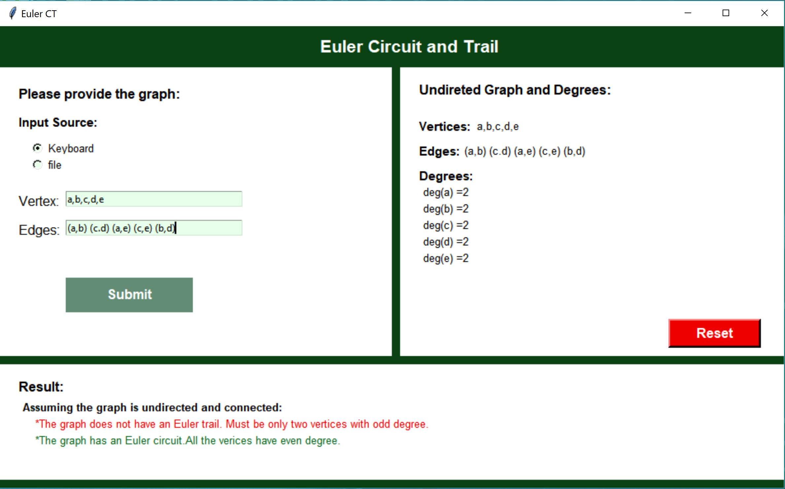

# Euler Circuit-Trail
This is a Python desktop application that given a graph (vertices and edges) the program calculates the degree of each vertex and indicates if the given graph has a Euler circuit or Euler trail or neither.  

